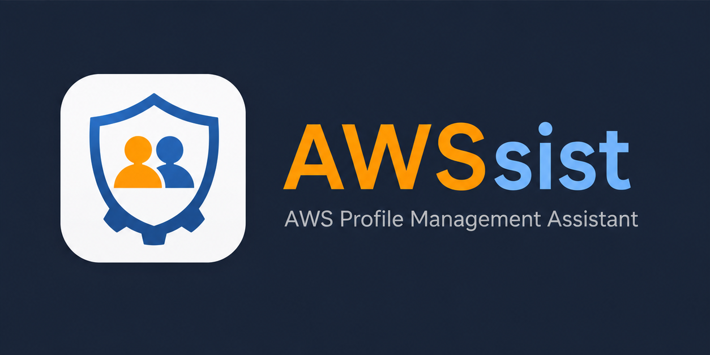

<p align="center">
  <picture>
    <source media="(prefers-color-scheme: dark)" srcset="docs/banner-dark.png">
    <source media="(prefers-color-scheme: light)" srcset="docs/banner-light.png">
    
  </picture>
</p>

# AWSsist

**AWS Profile Management Assistant** — a desktop app that turns the team's
collection of AWS CLI scripts into a single window. Sign in to your SSO once,
import every account/role as a profile in a couple of clicks, then browse
ECS / EC2 / RDS / Redis across accounts. One-click SSM port-forwarding tunnels
and SSM / ECS exec shells in your native Terminal.

Built with Electron + TypeScript. Runs on macOS, Linux, and Windows.

---

## Features

- **SSO sign-in via the AWS OIDC device-authorization flow** — done in-process,
  no `aws sso login` subprocess. Shares the standard `~/.aws/sso/cache` so
  other tools (aws CLI, boto3, Terraform) reuse the same session.
- **Profile discovery** — once signed in, list every account × role pair under
  the SSO and import them as profiles in bulk, with editable per-profile names
  and regions.
- **Leapp-style "New profile" dialog** for the rare cases you need a manual
  entry: AWS IAM Role Federated (SSO), AWS IAM User (static keys),
  or AWS IAM Role Chained (assume-role from another profile).
- **EC2 browser** with full instance details, search, and one-click
  `aws ssm start-session` in your terminal.
- **ECS browser** — clusters → services → tasks → containers. One-click
  `aws ecs execute-command` shell in your terminal.
- **RDS / Redis tunnels** — discovers Aurora/RDS clusters and ElastiCache
  endpoints; opens an SSM port-forwarding tunnel via a tagged bastion EC2.
- **Tunnel manager** — live state per tunnel, clean teardown that kills the
  whole `aws ssm` + `session-manager-plugin` process group so the local port
  is reusable the moment you click Stop.
- **Sessions tab** — short-lived credentials written to `~/.aws/credentials`
  for tools that don't honour named profiles directly. Auto-expires.
- **Dark / Light / System theme**.
- **DevTools accessible** via View menu → Toggle Developer Tools
  (⌥⌘I / Ctrl+Shift+I) so you can read any unexpected error.

---

## System requirements

| Component | Minimum |
| --- | --- |
| macOS | 12 (Apple Silicon or Intel) |
| Windows | 10 / 11 (x64 or arm64) |
| Linux | x64 or arm64, any distro that runs AppImage |
| `aws` CLI v2 | Required for ECS exec / SSM session / SSM tunnel |
| `session-manager-plugin` | Required for SSM tunnels and SSM sessions |
| A terminal emulator (Linux only) | One of: `gnome-terminal`, `konsole`, `kitty`, `alacritty`, `wezterm`, `tilix`, `xfce4-terminal`, `xterm`, or `x-terminal-emulator` |

AWSsist checks for `aws` CLI and `session-manager-plugin` on startup and
shows a warning in the sidebar + Settings if either is missing.

---

## Installation

### macOS (recommended — Homebrew tap)

Apple Silicon only for now.

```sh
brew tap petro-t/awssist
brew install --cask awssist

# AWS CLI dependencies AWSsist relies on at runtime
brew install awscli
brew install --cask session-manager-plugin
```

Future updates:

```sh
brew upgrade --cask awssist
```

Uninstall:

```sh
brew uninstall --cask awssist           # remove the app
brew uninstall --cask --zap awssist     # remove the app + per-user state
```

The cask auto-strips the macOS quarantine flag, so the app opens cleanly on
first launch — no "damaged" prompt, no `xattr` workaround.

### macOS (manual `.dmg` install)

If you'd rather not use Homebrew:

1. Download `AWSsist-<version>-arm64.dmg` (Apple Silicon) from the latest release.
2. Open the DMG and drag **AWSsist.app** to **Applications**.
3. Run once to clear Gatekeeper's quarantine flag (the build is unsigned):

   ```sh
   xattr -cr /Applications/AWSsist.app
   ```

4. Install the AWS CLI dependencies:

   ```sh
   brew install awscli
   brew install --cask session-manager-plugin
   ```

### Windows

1. Download `AWSsist-Setup-<version>-x64.exe` (or `arm64.exe` for ARM Windows).
2. Double-click to run. SmartScreen warning is expected on the first run —
   click **More info → Run anyway**.
3. The installer lets you pick the install location and creates a Start Menu
   shortcut.
4. Install the AWS CLI dependencies:

   - **AWS CLI v2** — [Windows MSI installer](https://docs.aws.amazon.com/cli/latest/userguide/getting-started-install.html#getting-started-install-windows)
   - **Session Manager plugin** — [Windows MSI installer](https://docs.aws.amazon.com/systems-manager/latest/userguide/session-manager-working-with-install-plugin.html#install-plugin-windows)

   Make sure both are on your `PATH`. Reboot or open a fresh terminal after
   install so AWSsist sees them.

A **portable** edition (`AWSsist-<version>-portable-x64.exe`) is also published —
it doesn't install, just run it from anywhere.

### Linux

1. Download `AWSsist-<version>-x86_64.AppImage` (or `-arm64.AppImage`).
2. Make it executable and run it:

   ```sh
   chmod +x AWSsist-*.AppImage
   ./AWSsist-*.AppImage
   ```

3. Install the AWS CLI dependencies via your distro or upstream packages:

   - **AWS CLI v2** — see [Linux install guide](https://docs.aws.amazon.com/cli/latest/userguide/getting-started-install.html#cli-install-linux)
   - **Session Manager plugin** — [Linux .deb / .rpm](https://docs.aws.amazon.com/systems-manager/latest/userguide/session-manager-working-with-install-plugin.html#install-plugin-linux)

4. AWSsist opens shells through whichever terminal emulator it finds first
   (gnome-terminal, konsole, kitty, alacritty, …). If you use a less common
   one, make sure it's on your `PATH` or symlink it to one of the supported
   names.

A native `.deb` (Debian/Ubuntu) can be built on a Linux host with
`npm run dist:linux:full`. We don't ship one with releases because the
upstream packager (`fpm`) produces broken archives when cross-compiled from
macOS.

---

## First-time setup

When you launch AWSsist for the first time, `~/.aws/config` is probably empty.
Follow these steps:

1. **Add an SSO session** — Profiles tab → **+ SSO session**. Enter your org's
   `start_url` (e.g. `https://<org>.awsapps.com/start`), the SSO region
   (often `us-east-1` or `us-west-2`), and a friendly session name.
2. **Sign in** — the new card appears at the top of the Profiles tab. Click
   **Sign in**. Your browser opens to the SSO portal with a one-time code
   shown in the card; confirm it and approve in the browser.
3. **Discover accounts** — once the card flips to *signed in*, click
   **Discover accounts**. Every account / role pair you have access to is
   listed. Select the ones you want, give each a profile name and region, and
   click **Import N**. Each becomes a profile in `~/.aws/config`.
4. **Use the resource tabs** — pick a profile from the dropdown at the top of
   any resource tab (EC2 / ECS / RDS / Redis). The bar under it shows your
   resolved STS identity; if it goes green you're good.

After the first time, opening AWSsist on a new day just means clicking
**Sign in** on the SSO card again — every profile under it picks up the new
token automatically.

---

## Usage

### Profiles

- Each profile shows a kind badge (SSO / IAM User / Role) and an "SSO valid"
  marker when its SSO session is signed in.
- **▶ Start session** writes short-lived credentials to `~/.aws/credentials`
  for the next ~1 hour, so external tools (psql, terraform, etc.) can pick
  them up via `AWS_PROFILE=<name>`.
- **DEF** does the same but also overwrites `[default]` — handy when a tool
  ignores `AWS_PROFILE`.
- **↗ Open AWS console** opens the SSO portal so you can pick the same role
  in the browser.
- **🗑 Remove** deletes the profile from `~/.aws/config`, any credentials
  entry from `~/.aws/credentials`, and its alias from `~/.aws/awssist.json`.

### EC2

- Lists all non-terminated instances in the selected profile / region.
- Live search across name, instance ID, IP, type, state, and tag values.
- **SSM** button opens `aws ssm start-session --target <id>` in your native
  terminal. Disabled on stopped instances since SSM agent isn't running.

### ECS

- Three-pane browser: clusters → services → tasks (with their containers).
- One-click container shell — opens `aws ecs execute-command` in the native
  terminal. No PTY emulation in-app, so the session can't freeze or desync.

### RDS / Redis tunnels

- Auto-detects a bastion EC2 host (tag `Name=*bastion*`). If you have more
  than one, the tunnel dialog gives you a picker.
- One click on **Writer** / **Reader** / **Tunnel** opens a modal where you
  pick the bastion and local port; AWSsist spawns the
  `aws ssm start-session` port-forwarding tunnel and tracks it on the
  **Tunnels** tab.
- Stop deletes the entire process group (parent `aws` + child
  `session-manager-plugin`), so the local port is freed immediately and the
  row disappears once the OS confirms the processes are gone.

### Tunnels

- Live status: starting / running / stopped / error.
- Errors include the tail of the underlying tool output so you can see
  port-in-use / permission-denied / etc.

### Settings

- Theme picker (Light / System / Dark).
- Dependency check (aws CLI, session-manager-plugin).
- About info.

---

## Where AWSsist stores things

| Path | What |
| --- | --- |
| `~/.aws/config` | Profile and SSO session definitions (standard aws CLI file) |
| `~/.aws/credentials` | Short-lived creds written by "Start session"; static IAM-user keys |
| `~/.aws/sso/cache/*.json` | SSO access tokens (standard aws CLI cache; shared with `aws` CLI / boto3 / SDKs) |
| `~/.aws/awssist.json` | Optional friendly **Session Aliases** displayed in the UI |

AWSsist treats `~/.aws/config` and `~/.aws/credentials` as the source of
truth. Editing them by hand still works; AWSsist re-reads on every refresh.

---

## Development

```sh
# clone, then
npm install
npm run dev          # hot-reload Electron + Vite
npm run typecheck    # TS strict checks for main + renderer
npm run build        # production bundles into out/
```

### Project layout

```
src/
├── main/             Electron main process (Node)
│   ├── aws/          ~/.aws config + credentials + SSO cache + alias store
│   ├── ipc/          One module per IPC namespace (profiles, sso, ecs, …)
│   ├── menu.ts       App menu (incl. DevTools shortcut)
│   └── index.ts      App entry
├── preload/          contextBridge — exposes typed window.awssist API
├── renderer/         React + Tailwind UI
└── shared/types.ts   IPC contract between main and renderer
```

The renderer never touches Node or AWS APIs directly — everything goes
through the preload's `AwssistApi` contract.

### Building installers

```sh
npm run dist:mac           # macOS arm64 .dmg
npm run dist:mac:universal # arm64 + x64 .dmg
npm run dist:win           # Windows NSIS .exe (x64 + arm64) + portable .exe
npm run dist:linux         # Linux AppImage (x64 + arm64)
npm run dist:linux:full    # AppImage + .deb (must run on Linux)
npm run dist:all           # macOS + Windows + Linux from one host
```

Cross-compile from any host is supported except `.deb` — that target needs
a Linux host because the bundled `fpm` is broken on modern macOS.

### macOS signing & notarization

`npm run dist:mac` produces a signed + notarized `.dmg` when the following
five environment variables are set:

```sh
export CSC_LINK="$HOME/.codesign/awssist-developer-id.p12"
export CSC_KEY_PASSWORD="<password used when exporting the .p12>"
export APPLE_ID="<your Apple ID email>"
export APPLE_APP_SPECIFIC_PASSWORD="<16-char app-specific password>"
export APPLE_TEAM_ID="<10-char Team ID>"

npm run dist:mac
```

- The `.p12` must be a **Developer ID Application** certificate (not Mac App
  Distribution — that's a different cert for the Mac App Store).
- Generate the app-specific password at https://appleid.apple.com → Sign-In
  and Security → App-Specific Passwords.
- Notarization adds 2–10 minutes on top of the build — electron-builder
  uploads the binary, polls Apple, and staples the resulting ticket to the
  `.dmg` automatically.
- For a quick unsigned local build, set `CSC_IDENTITY_AUTO_DISCOVERY=false`
  and electron-builder skips signing entirely.

A signed + notarized `.dmg` opens with **zero warnings** on macOS — no
"unidentified developer", no "damaged" message, no `xattr` workaround.

---

## Code signing status

| Platform | Status |
| --- | --- |
| **macOS** | Signed (Developer ID Application) + notarized when build env vars are set — opens cleanly |
| **Windows** | Unsigned — SmartScreen warns; click "More info → Run anyway" |
| **Linux** | AppImage runs unchallenged; there is no signing on Linux anyway |

For internal distribution this is fine. To publish externally, add an
Apple Developer certificate and an Authenticode certificate to the
`electron-builder.yml` config.

---

## Troubleshooting

**"Could not resolve credentials using profile"** — your SSO session expired.
Click **Sign in** on the SSO session card.

**"address already in use" when starting a tunnel** — something else is bound
to that local port. Either pick a different port in the tunnel dialog, or
run `lsof -nP -iTCP -sTCP:LISTEN | grep :<port>` to find what's holding it.

**ECS / SSM session window closes immediately** — usually means `aws` or
`session-manager-plugin` isn't on `PATH`. Open Settings → confirm both are
green. On Windows, install via the official MSI installers (not pip).

**The icon hasn't updated after install** — macOS aggressively caches dock
icons. `killall Dock && killall Finder`, or log out and back in.

---

## License

[MIT](LICENSE) © 2026 Peter Tretiakov.

Free to use, modify, and redistribute. AWSsist bundles third-party components
under their own permissive licenses (Electron — MIT, React — MIT, the AWS SDK
for JavaScript — Apache-2.0, and others).
